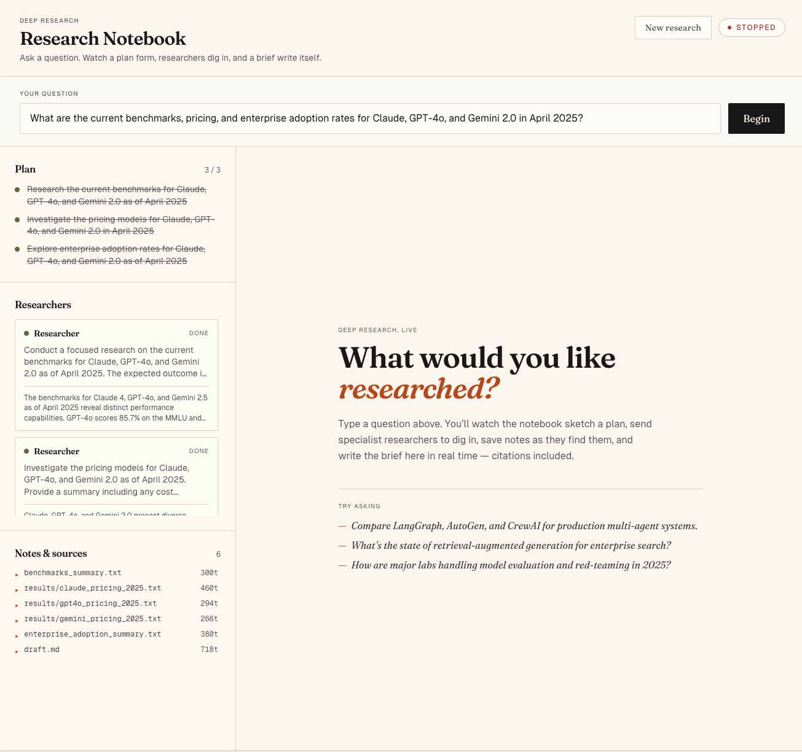
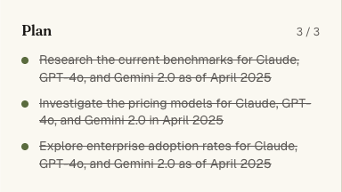
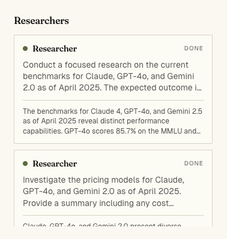
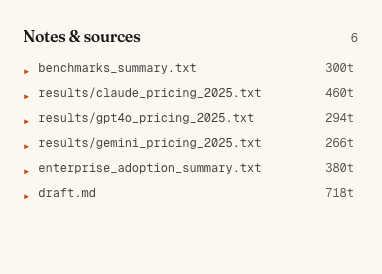

# Deep Agents Research Assistant

Demo project showcasing the **5 built-in capabilities** of [LangChain Deep Agents](https://github.com/langchain-ai/deepagents):
1. Planning (`write_todos`)
2. Virtual filesystem (context offloading)
3. Subagent spawning
4. Automatic context compression
5. Cross-conversation memory

Each capability is **observable on a live dashboard** rather than buried in logs.

## Screenshots

**Full dashboard** — question submitted, plan active, researchers working, welcome screen before first input:



**Plan** — 3 / 3 sub-topics completed with strikethrough styling once research finishes:



**Researchers** — each specialist shown with task description and summary once done:



**Notes & sources** — virtual filesystem files saved by researchers, with token counts:



## Repository Layout

```
chat-agents/
├── apps/
│   ├── api/        # FastAPI backend (Python 3.11+, Deep Agents, LangGraph)
│   └── web/        # Next.js 14 frontend (TypeScript, Tailwind)
├── docs/           # Specs, plans, notes
├── .editorconfig   # Cross-editor formatting baseline
└── CONTRIBUTING.md # Code style + commit conventions
```

## Quickstart

### Prerequisites
- Python 3.11+
- Node.js 20+
- Anthropic API key (`sk-ant-...`)
- Tavily API key (free tier at https://tavily.com)

### 1. Backend
```bash
cd apps/api
python -m venv .venv && source .venv/bin/activate
pip install -e ".[dev]"
cp .env.example .env       # fill in keys
uvicorn app.main:app --reload --port 8000
```

### 2. Frontend (separate terminal)
```bash
cd apps/web
npm install
cp .env.example .env.local # fill in API_URL
npm run dev
```

Open http://localhost:3000/research.

## Example Research Questions

Three questions designed to exercise increasing amounts of the agent pipeline.
Start with **#1** to verify the setup is healthy before trying the longer ones.

---

### 1 — Quick smoke test (3–4 researcher spawns, ~60–90 s)

> Compare LangGraph, AutoGen, and CrewAI for building production multi-agent
> systems in 2025 — cover architecture, streaming support, memory, and known
> production failures.

**What to watch on the dashboard:**
- **Todo list** — planner breaks this into 3–4 sub-topics immediately
- **Subagent panel** — `researcher` spawns once per framework, then a `critic` pass
- **Files sidebar** — raw search results and `draft.md` saved to the virtual FS
- **Report panel** — final revised markdown report streams in progressively

---

### 2 — Multi-model comparison (2–3 researcher spawns, ~45–75 s)

> What are the current benchmarks, pricing, and enterprise adoption rates for
> Claude, GPT-4o, and Gemini 2.0 in April 2025?

**What to watch on the dashboard:**
- Tavily searches fire for each model (pricing is not in training data)
- `file_saved` events appear as researchers persist raw results to VFS
- Critic flags any pricing figures that lack citations

---

### 3 — Full-feature stress test (5 researcher spawns, 3–6 min)

> Write a comprehensive research report on the AI agent tooling ecosystem in
> 2025: key frameworks, memory architectures, deployment patterns, evaluation
> methods, and open research challenges.

**What to watch on the dashboard:**
- **5 todos** written by the planner — one per listed sub-topic
- **Compression badge** — state typically exceeds 30 000 tokens; compression
  event fires and is visible in the sidebar
- All panels (todos, files, subagents, compression, report) active simultaneously

> See [`docs/sample-research-questions.txt`](./docs/sample-research-questions.txt)
> for full annotations and expected SSE event sequences.

---

## Documentation

- [Design spec](./docs/2026-04-13-deep-agents-research-assistant-design.md)
- [Implementation plan](./docs/2026-04-13-deep-agents-research-assistant-plan.md)
- [Article notes (Deep Agents)](./docs/2026-04-13-langchain-deep-agents-notes.md)
- [Contributing guide](./CONTRIBUTING.md)
